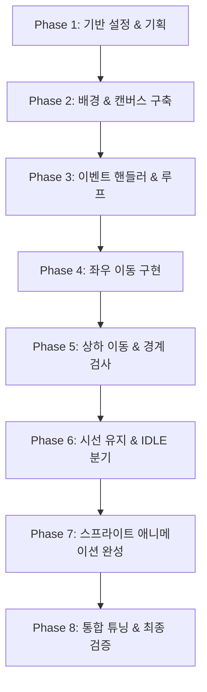

# [PRD] Drill 09 - 소년 캐릭터 이동 및 애니메이션 뷰어

## 1. 프로젝트 개요 (Overview)
- **과제명**: 2D 게임프로그래밍 Drill 09 - 애니메이션 뷰어 및 방향키 캐릭터 제어
- **목적**: `pico2d` 라이브러리를 활용하여 단일 파일(`character_run.py`)로 배경 위에서 소년 캐릭터의 상하좌우 이동, 시선 유지, 경계 제한 및 상태별(IDLE/RUN) 스프라이트 애니메이션을 완벽하게 구현한다.
- **제출 형식**: 
  - GitHub 리포지토리 URL (`.git` 확장자 형태: `https://github.com/donghyeong-1/DRILL9.git`)
  - 모든 리소스 및 실행 파일 포함 (상대경로 필수)
  - **최소 25회 이상의 단계별 커밋** 기록 필수 (커밋 부족 시 0점 처리 방지)

---

## 2. 기술 스택 및 환경 (Tech Stack & Environment)
- **개발 언어**: Python 3.12+
- **그래픽 라이브러리**: `pico2d`
- **단일 소스 코드 파일**: `character_run.py`
- **대상 리소스**:
  - 배경: `TUK_GROUND.png` (해상도: 1280 x 1024)
  - 캐릭터 스프라이트 시트: `animation_sheet.png` (해상도: 802 x 402, 단위 프레임: 100 x 100)
- **리소스 경로 규정**:
  - 절대경로 사용 불가
  - 반드시 소스코드 기준 상대경로(`'TUK_GROUND.png'`, `'animation_sheet.png'`)로 지정

---

## 3. 핵심 기능 요구사항 (Functional Requirements)

### 3.1 캔버스 및 배경 구성
- 캔버스 해상도: `1280 x 1024` (TUK_GROUND 이미지 크기와 일치)
- 배경 렌더링: `TUK_GROUND.png`를 캔버스 중앙(`x=640, y=512`)에 항상 출력
- 마우스 커서 숨김: `hide_cursor()` 처리

### 3.2 상하좌우 방향키 이동 (3점)
- **입력 처리**:
  - 키보드 이벤트(`SDL_KEYDOWN`, `SDL_KEYUP`)를 감지하여 4방향 이동 벡터(`dx`, `dy`) 갱신
  - 방향키: `SDLK_LEFT`, `SDLK_RIGHT`, `SDLK_UP`, `SDLK_DOWN`
  - 종료키: `SDLK_ESCAPE` 또는 창 닫기 이벤트(`SDL_QUIT`) 수신 시 프로그램 정상 종료
- **부드러운 다중 키 이동**:
  - KeyDown 시 해당 방향 속도 가산, KeyUp 시 감산하여 부드러운 대각선 및 연속 이동 지원
  - 프레임당 이동 속도(예: 5픽셀) 적용

### 3.3 시선 방향 및 IDLE / RUN 애니메이션 (1점)
- **스프라이트 시트 구조 (`animation_sheet.png`)**:
  - 프레임 크기: `100 x 100`, 총 8프레임(0~7)
  - `bottom = 100`: 오른쪽 달리기 (RUN RIGHT)
  - `bottom = 0`: 왼쪽 달리기 (RUN LEFT)
  - `bottom = 200`: 오른쪽 대기 (IDLE RIGHT)
  - `bottom = 300`: 왼쪽 대기 (IDLE LEFT)
- **시선 방향(Facing Direction) 관리**:
  - 좌/우 이동 시 해당 방향으로 시선 갱신 (`look_dir = RIGHT` 또는 `LEFT`)
  - **상/하 이동 시**: 기존 바라보던 시선 방향(`look_dir`)을 유지한 채 달리기 애니메이션 재생
- **동작 상태(Action State)**:
  - `is_moving == True` (이동 중): 현재 시선 방향에 맞는 RUN 애니메이션 (오른쪽: `bottom=100`, 왼쪽: `bottom=0`)
  - `is_moving == False` (정지 중): 마지막 시선 방향에 맞는 IDLE 애니메이션 (오른쪽: `bottom=200`, 왼쪽: `bottom=300`)
- **프레임 갱신**:
  - `frame = (frame + 1) % 8` 순환 구조
  - `delay(0.05)` 간격으로 일정한 속도 유지

### 3.4 화면 경계 제한 (1점)
- 캐릭터가 배경 화면(1280 x 1024) 밖으로 나가지 않도록 좌표 클램핑(Clamping)
- 캐릭터 크기(100x100)를 감안한 여백 적용:
  - `x` 유효 범위: `50 <= x <= 1280 - 50` (50 ~ 1230)
  - `y` 유효 범위: `50 <= y <= 1024 - 50` (50 ~ 974)
- 화면 끝에 도달했을 때 추가 이동을 차단하고 경계면에 머무름

---

## 4. 채점 기준 및 대응 방안

| 채점 항목 | 배점 | 구현 명세 및 검증 방식 |
| :--- | :---: | :--- |
| **상하좌우 이동** | 3점 | 좌, 우, 상, 하 키보드 입력을 통해 부드럽게 캐릭터가 4방향 및 대각선으로 이동하는가 |
| **IDLE 애니메이션** | 1점 | 키 입력이 멈췄을 때 즉시 직전 시선 방향의 IDLE 애니메이션으로 전환되는가 |
| **화면 경계면 제한** | 1점 | 캐릭터가 화면 4면 끝에 도달했을 때 밖으로 벗어나지 않고 유지되는가 |
| **주의사항 준수** | 필수 (미준수 시 0점) | 1. 퍼블릭 리포지토리 `.git` URL 제출 2. **최소 25개 이상의 점진적 단계별 커밋 로그** 3. 리소스 상대경로 지정 |

---

## 5. 단계별 개발 및 커밋 계획 (최소 25개 커밋 달성 로드맵)

과제 규정인 **"단계별 개발 및 최소 25개 이상의 커밋"**을 정확히 준수하기 위해 다음과 같이 28단계 단위로 개발을 분할하여 실행합니다.

### 상세 커밋 목록

#### Phase 1: 기반 설정 및 기획 (Commit 1~3)
1. `docs: PRD(요구사항 정의서) 작성`
2. `chore: 프로젝트 리소스 경로 및 상대경로 검증`
3. `refactor: character_run.py 기본 파일 구조 정리`

#### Phase 2: 기본 캔버스 및 배경 렌더링 (Commit 4~6)
4. `feat: 화면 크기 상수(1280x1024) 및 캔버스 초기화 추가`
5. `feat: TUK_GROUND 배경 이미지 로드 및 중앙 렌더링 구현`
6. `feat: 마우스 커서 숨김(hide_cursor) 설정 추가`

#### Phase 3: 메인 이벤트 루프 및 종료 이벤트 (Commit 7~9)
7. `feat: 프로그램 실행 상태 변수(running) 및 메인 루프 구조 추가`
8. `feat: SDL_QUIT(창 닫기) 이벤트 처리 구현`
9. `feat: SDLK_ESCAPE 키 입력 시 프로그램 종료 처리 추가`

#### Phase 4: 캐릭터 기본 배치 및 데이터 구조 (Commit 10~12)
10. `feat: animation_sheet 캐릭터 스프라이트 이미지 로드`
11. `feat: 캐릭터 위치 좌표(x, y) 초기값을 화면 중앙으로 설정`
12. `feat: 캐릭터 정적 스프라이트 클립 렌더링 추가`

#### Phase 5: 좌우 이동 제어 (Commit 13~15)
13. `feat: 좌우 이동 방향 변수(dir_x) 및 KEYDOWN 이벤트 매핑`
14. `feat: 좌우 KEYUP 이벤트 매핑으로 이동 정지 처리`
15. `feat: dir_x 기반 x 좌표 업데이트 및 이동 속도 적용`

#### Phase 6: 상하 이동 제어 (Commit 16~18)
16. `feat: 상하 이동 방향 변수(dir_y) 및 KEYDOWN 이벤트 매핑`
17. `feat: 상하 KEYUP 이벤트 매핑으로 이동 정지 처리`
18. `feat: dir_y 기반 y 좌표 업데이트 및 대각선 이동 지원`

#### Phase 7: 화면 경계 제한 처리 (Commit 19~21)
19. `feat: 캐릭터 반폭(margin) 고려한 x좌표 경계 클램핑 구현`
20. `feat: 캐릭터 반높이 고려한 y좌표 경계 클램핑 구현`
21. `refactor: clamp 유틸리티 로직 적용으로 경계 검사 가독성 개선`

#### Phase 8: 시선 방향 유지 및 상태 관리 (Commit 22~24)
22. `feat: 캐릭터 시선 방향 변수(look_dir) 도입 및 좌우 이동 시 갱신`
23. `feat: 상하 이동 시 기존 시선 방향 유지 로직 보장`
24. `feat: 키 입력 상태에 따른 이동/대기(is_moving) 상태 판별 로직 추가`

#### Phase 9: 애니메이션 프레임 제어 및 스프라이트 연동 (Commit 25~27)
25. `feat: 8프레임 순환 애니메이션 카운터 및 딜레이(0.05s) 적용`
26. `feat: 시선 방향에 따른 좌/우 달리기(RUN) 스프라이트 행 매핑`
27. `feat: 정지 상태 시 시선 방향에 따른 IDLE 스프라이트 행 매핑`

#### Phase 10: 최종 통합, 검증 및 정리 (Commit 28)
28. `chore: 코드 주석 정리 및 과제 채점 기준 최종 검증 완료`

---

## 6. 완료 조건 (Definition of Done)
1. `character_run.py` 실행 시 오류 없이 TUK_GROUND 배경과 캐릭터가 출력된다.
2. 상하좌우 및 대각선 방향키 조작 시 캐릭터가 정상 이동한다.
3. 캐릭터가 화면 밖(1280x1024)으로 나가지 않고 경계면에 머무른다.
4. 이동 시에는 달리기 애니메이션, 정지 시에는 IDLE 애니메이션이 동작한다.
5. 위/아래로 이동할 때 직전 좌/우 시선 방향이 유지된다.
6. Git 커밋 이력이 최소 25개 이상 체계적으로 기록되어 원격 저장소(`main` 브랜치)에 푸시되어 있다.
7. 리소스 파일은 모두 상대경로로 참조된다.
